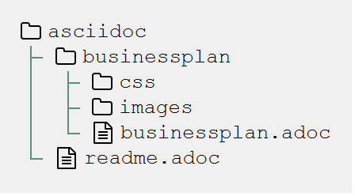

= Jobikado
:toc-title: Inhalt
:toc: macro

toc::[]

Jobikado ist ein Portal für Mitarbeiterbindung und Karriere. Es richtet sich im Unternehmen an zwei Zielgruppen:

* an die *Geschäftsführung* und
* die *festangestellten Fachkräfte* ohne Personalverantwortung.

Mit Jobikado erhält die Unternehmensleitung ein *freiwilliges, anonymes* Feedback der Mitarbeiter über deren Bindung an das Unternehmen. Aufgrund dieses Feedbacks kann die Unternehmensleitung entscheiden, das Gehalt regelmäßig adäquat anzupassen - oder nicht. Versäumt sie es und steuert bei einer geringen Mitarbeiterbindung auch nicht anderweitig gegen, hilft Jobikado den festangestellten Fachkräften bei der Jobsuche.

Der Name _Jobikado_ leitet sich von einer großen Gefahr ab: kündigen in einem Unternehmen zu viele Fachkräfte zur gleichen Zeit, ist es nicht mehr möglich, jahrelang erworbene Erfahrung weiterzugeben. Das Unternehmen implodiert, ähnlich wie beim Mikado. Entzieht man der komplexen Struktur zugleich zu viele Stäbchen, fällt alles in sich zusammen.

== Ausgangslage

=== Problem 1: Unternehmen sucht Mitarbeiter und will keine verlieren

Vollzieht sich der Fortgang des mobilen Teils der Belegschaft (Fachkräfte ohne Personalverantwortung) zu schnell, kann dies nicht mehr mit dem immobilen Teil der Belegschaft abgefangen werden. Es verbleibt nicht genügend Zeit, das Wissen und die Erfahrung weiterzureichen. Die Firma ist in ihrem Fortbestand gefährdet.

=== Problem 2: Unternehmen will Innovationskraft erhalten und steigern

Jedes Unternehmen möchte für die Zukunft gewappnet und innovativ sein. Doch was passiert, wenn eine Fachkraft geht? Es kommt ein neuer Mitarbeiter hinzu, der zuvorderst mit Einarbeitung und nicht mit Innovation beschäftigt ist. Wie entstehen Innovation innerhalb einer Firma? Es reicht nicht, Ideen im Firmenwiki zu äußern. Für deren Verwirklichung muss der Innovator Politik betreiben und Verbündete finden. Dafür muss er zwingend auf das in Jahren zuvor erlangte Vertrauen der Kollegen der gesamten Firma zurückgreifen. Dieses abteilungsübergreifende Vertrauen kann sich kaum aufbauen, wenn Mitarbeiter immer wieder die Firma verlassen. Ein Unternehmen bleibt nur innovativ, wenn es Fachkräfte hat, die sich gegenseitig vertrauen. Ohne sie werden neue Ideen nicht aufgenommen und transportiert.

Neben der Unternehmensführung ist auch die gelernte bzw. studierte Fachkraft mit Problemen konfrontiert.

=== Problem 3: Fachkraft wünscht sich höheres Gehalt - traut sich nicht, es einzufordern

Das Gehalt ist Grundlage eines jeden Arbeitsverhältnisses. Habe ich ein zu geringes Gehalt, nützen mir auch die sogenannten Benefits wenig: der Vermieter fordert die Miete in Euro ein und nicht in Form von gefüllten Kaffeetassen. Habe ich als Fachkraft ein adäquates Gehalt, bin ich in der Lage, für alles Weitere im Unternehmen zu kämpfen: für Innovation, Respekt, Wohlfühlklima uvm. Ein angemessenes Gehalt über Jahre hinweg ist die profundeste Anerkennung der Leistungen einer festangestellten Fachkraft.

Für eine kontinuierliche Gehaltsanpassung wäre es das Optimum, dass jede Fachkraft ein gutes Verhältnis zum Vorgesetzten hat und womöglich im ständigen Kontakt zur Geschäftsführung steht. Darüber hinaus hat er oder sie ein gesundes Selbstbewusstsein. Viele Mitarbeiter haben jedoch nicht den Mut, kontinuierlich beim Vorgesetzten wegen einer Gehaltserhöhung vorzusprechen.

Jobikado hat einen Weg gefunden, die oben genannten Probleme mit EINER Lösung zu bekämpfen und abzumildern.

Die Gründer erstellen derzeit einen Prototypen, sind aber, was die Wahl der Technologie uvm. betrifft, noch völlig offen. Das ist auch die Stärke von Jobikado: es steht auch in der Unternehmensform neuen Wegen aufgeschlossen gegenüber. Nachhaltigkeit konsequent zu Ende gedacht, könnte auch heißen, dass Jobikado eine Genossenschaft der Dateneigentümer werden kann - mit juristischen Personen (Unternehmen) als gleichberechtigte Mitglieder.

== Verzeichnisse

=== _gettingstarted_

5 Seiten für einen leichten Einstieg in die Welt von Jobikado.

=== _businessplan_

Die Gründer beteiligen sich am Businessplanwettbewerb Berlin-Brandenburg 2019/2020: https://www.b-p-w.de/

=== _queb_

Die Gründer beteiligen sich am Queb HR Innovation Award des Queb Bundesverbandes: https://www.queb.org/aktivitaeten/queb-hr-innovation-awards/

Die Wettbewerbsbeiträge waren auf 5 Seiten beschränkt.

== Wie kann ich unterstützen?

. Deine Meinung zu Jobikado per Mail an strategie@jobikado.de
. Deine Meinung öffentlich: Eröffne einen _Issue_ in diesem Repository.
. Gitter-Community zu Jobikado in Planung.
. Folge uns auf Twitter @jobikado

Danke Dir ;-)

== Wie erstelle ich aus den Adoc-Dateien PDFs?

Sämtliche Dokumente und Quellen zum Projekt wie Businessplan, Handouts uvm.

=== Asciidoctor installieren

Sämtliche Asciidoc-Dateien (.adoc) werden mit der Software Asciidoctor in HTML und PDF ausgegeben. Folgende Reihenfolge bei der Installation gilt es einzuhalten:

. Ruby installieren
. Asciidoctor installieren
. Asciidoctor für PDF installieren

Hier eine kleine https://petersell.de/asciidoc.html#_asciidoctor_auf_windows_einrichten[Anleitung auf petersell.de]

=== Dateistruktur

==== Verzeichnis _businessplan_

Ein Content-Verzeichnis für eine Publikation, hier dem Businessplan. Es werden weitere Contentverzeichnisse parallel erstellt, wie z.B. _Handout_ oder _Flyer_.

Das Verzeichnis _css_ mit seinen Stylesheets ist nur für die HTML-Generierung wichtig. Sämtliche Bilder einer Publikation im Format JPG oder PNG sind im Verzeichnis _images_ zu finden. So wird in einer adoc-Datei ein Bild anschliessend eingefügt:

[source]
----
.Eins schöne Bildunterschrift
image::staebchenbund1.png[pdfwidth=50%,align=left]
----

===== Datei _readme.adoc_

Diese Anleitung hier.

==== Asciidoc-Datei schreiben

[TIP]
====
Ein guter WYSIWYG-Editor ist https://asciidocfx.com/[AsciidocFX]. Etwas schwieriger, da nicht speziell auf Asciidoc zugeschnitten, ist Visual Studio Code.
====

Unverzichtbare Links:

* https://asciidoctor.org/docs/asciidoc-syntax-quick-reference/[Syntax Quick Reference]
* https://asciidoctor.org/docs/asciidoctor-pdf/[Asciidoc für PDF]
* https://asciidoctor.org/docs/user-manual/[User Manual]

[TIP]
====
Von Zeit zu Zeit den Asciidoctor und Asciidoctor-PDF im Kommandozeilenfenster aktualisieren mit `gem update asciidoctor` und `gem update asciidoctor-pdf`.
====

=== PDF erzeugen

Angenommen, das Verzeichnis _asciidoc_ liegt bei Dir auf Laufwerk C:\, dann lautet der Buildbefehl, den Du im Kommandozeilenfenster eingibst, folgendermaßen:

[source]
----
asciidoctor-pdf --trace -D C:\asciidoc\businessplan // <1>
C:\asciidoc\businessplan\businessplan.adoc // <2>
----
<1> Pfad zur Ausgabe-Datei
<2> Pfad der Quelldatei

Im selben Verzeichnis wie die Quelldatei `businessplan.adoc` befindet sich jetzt die PDF-Datei `businessplan.pdf`.